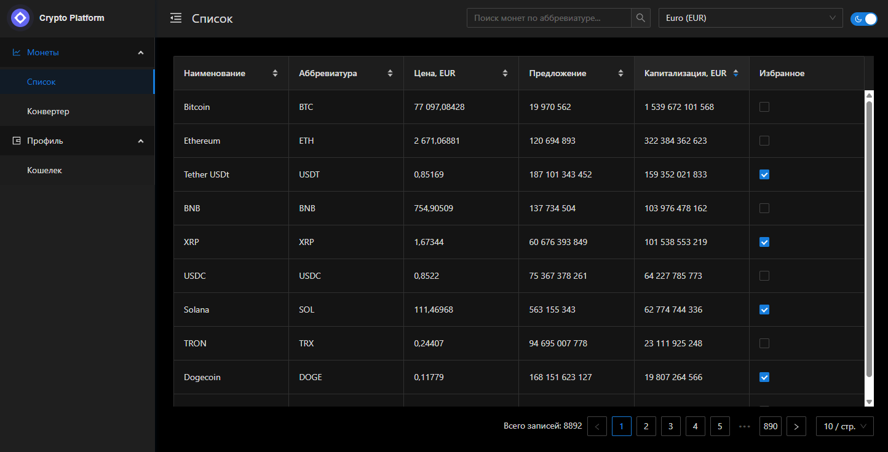
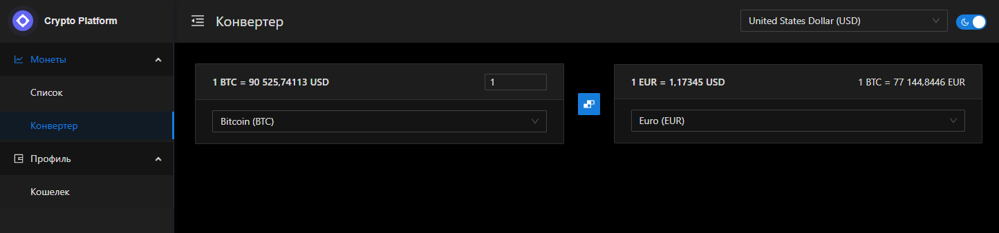
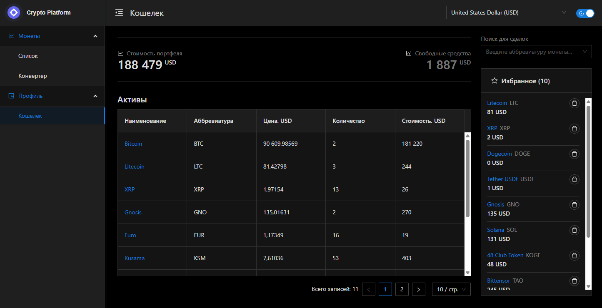

# CryptoPlatform

Приложение на тематику криптовалют.

## Функциональность

- ✅ Просмотр, фильтрация, поиск криптовалют
- ✅ Конвертация криптовалют
- ✅ Покупка, продажа, составление портфеля криптовалют
- ✅ Выбор светлой или темной темы

## Технологии

- **Angular** 20+
- **TypeScript**
- **SCSS**
- **Ant Design of Angular**
- **NgRx SignalStore**







## Установка и запуск

Установка зависимостей

```bash
npm install
```

Запуск frontend

```bash
npm run start
```

Запуск json-server

```bash
npm run start:api
```

Запуск frontend и json-server одной командой

```bash
npm run dev
```

Проект в браузере

```bash
http://localhost:4200
```
